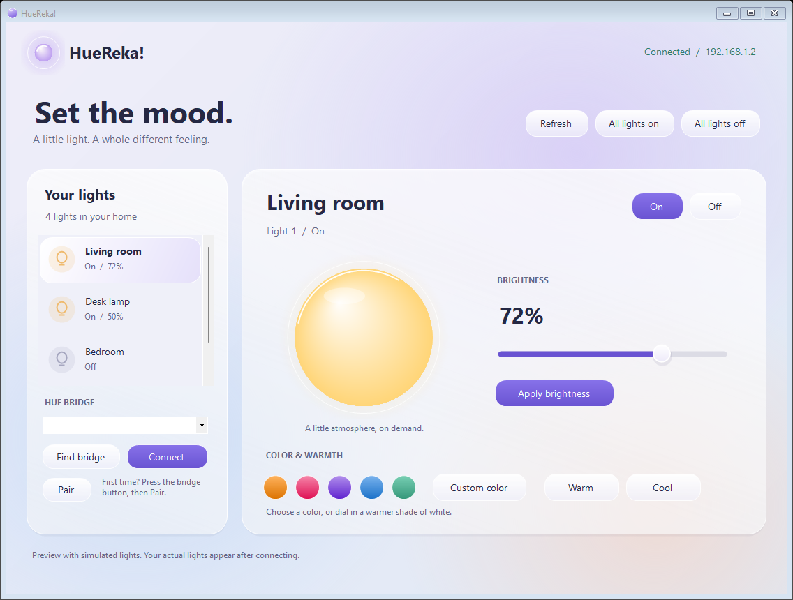

# HueReka!

A small native Windows application for controlling Philips Hue lights on your local network.



The desktop UI uses a Liquid Glass-inspired design with softly tinted glass panels, rounded controls, color swatches, and a light-color preview. This is a native Windows rendering of the visual style; it does not use Apple's platform components. Keyboard users can Tab between controls and adjust brightness with the arrow keys, Home, and End before choosing **Apply brightness**.

## Run

Double-click **Launch.cmd**, or run **dist\HueReka!.exe** after building. Windows 10/11 with .NET Framework 4.7.2 or newer is recommended. No SDK, npm packages, Hue account, or cloud login is needed. The executable is unsigned.

1. Connect your PC and Hue Bridge to the same network.
2. Click **Find bridge**, or enter its IPv4 address from the Hue app's bridge settings. If several bridges appear, choose one from the dropdown.
3. Press the round link button on the bridge, then click **Pair**. If the pairing window expires, press the button and retry.
4. Select a light and use **On**, **Off**, **Apply brightness**, the color swatches, **Custom color**, **Warm**, or **Cool**. Unsupported controls are disabled. Brightness and color changes also turn the light on. The orb previews the selected light's color; screen colors may differ from the bulb.
5. Use **Connect** on subsequent launches. **Refresh** reads changes made by other apps; there is no background polling. **All lights on/off** affects every light on that bridge.

## Command Prompt

The console executable is `dist\huereka.exe`. It shares the desktop app's saved pairing and never opens a window. In a normal Command Prompt:

```bat
cd /d "C:\Repos\HueReka!\dist"
huereka list
huereka on 1
huereka brightness 1 50
huereka color 1 FF8800
huereka warm 1
huereka cool 1
huereka off 1
```

Replace `1` with the ID shown by `huereka list`. Each command affects only that light. Brightness is 1-100 percent; brightness and white-temperature commands also turn the light on. Unsupported capabilities and unreachable lights return errors.

`huereka color <id> <RRGGBB>` accepts exactly six uppercase hexadecimal digits without `#`, such as `FF8800` for orange. It converts RGB to hue, saturation, and brightness and turns the light on; `000000` turns it off. Color-capable bulbs are required. Actual bulb colors may differ from screen colors.

If you have not paired yet, press the bridge's round button and run `huereka pair 192.168.1.20` using your bridge's IP address. Run `huereka help` for usage. Pairing is saved for the current Windows user; no API key needs to appear on the command line.

From any directory, use the full quoted path, for example `"C:\Repos\HueReka!\dist\huereka.exe" off 1`. In batch files that enable delayed expansion, run `setlocal DisableDelayedExpansion` before using the path containing `!`.

Exit codes (`echo %ERRORLEVEL%`): 0 means success, 1 means a connection/bridge/credential error, and 2 means invalid arguments, unknown light ID, or unsupported capability. Errors go to stderr. Run `huereka --self-test` for CLI tests with a simulated bridge; it does not contact real lights or change saved credentials.

## Build and verify

```powershell
powershell.exe -NoProfile -ExecutionPolicy Bypass -File .\build.ps1
$test = Start-Process .\dist\HueReka!.exe -ArgumentList '--test' -Wait -PassThru
$test.ExitCode
```

The build uses the C# compiler included with Windows' .NET Framework. Tests cover mock bridge pairing and routes, light parsing, Hue errors, brightness conversion, Windows credential encryption, and form construction. They write `preview.png`; failures write `test-failure.txt` and exit with code 1. Tests do not send commands to physical lights.

## Connection and security

Bridge calls use HTTPS and the Hue REST v1 API, following [Philips Hue's getting-started guide](https://developers.meethue.com/develop/get-started-2/). Only discovery uses the internet (`discovery.meethue.com`); manual IP entry and normal controls work locally. A bridge supporting HTTPS is required.

Pairing uses trust on first use: the certificate presented by the entered bridge is pinned for that connection and saved after successful pairing. Subsequent connections require the identical certificate. Perform initial pairing on a trusted home network. To accept a replaced bridge or renewed certificate, press its link button and Pair again. Certificate handling is scoped to bridge requests; discovery uses normal public certificate validation. No plaintext HTTP fallback is used.

The address, certificate fingerprint, and API key are encrypted using Windows DPAPI for the current user and saved in `%LOCALAPPDATA%\HueReka!\connection.dat`. One bridge connection is remembered. Deleting this file forgets the local credentials; it does not revoke the key on the bridge.

## Limitations

No rooms, scenes, schedules, entertainment streaming, remote access, or installer. RGB color controls use the bridge's hue/saturation support; color rendering depends on the bulb. Unreachable lights are shown but cannot be controlled individually. Requests time out after about seven seconds. Physical bridge pairing and bulb behavior must be verified on real hardware.
