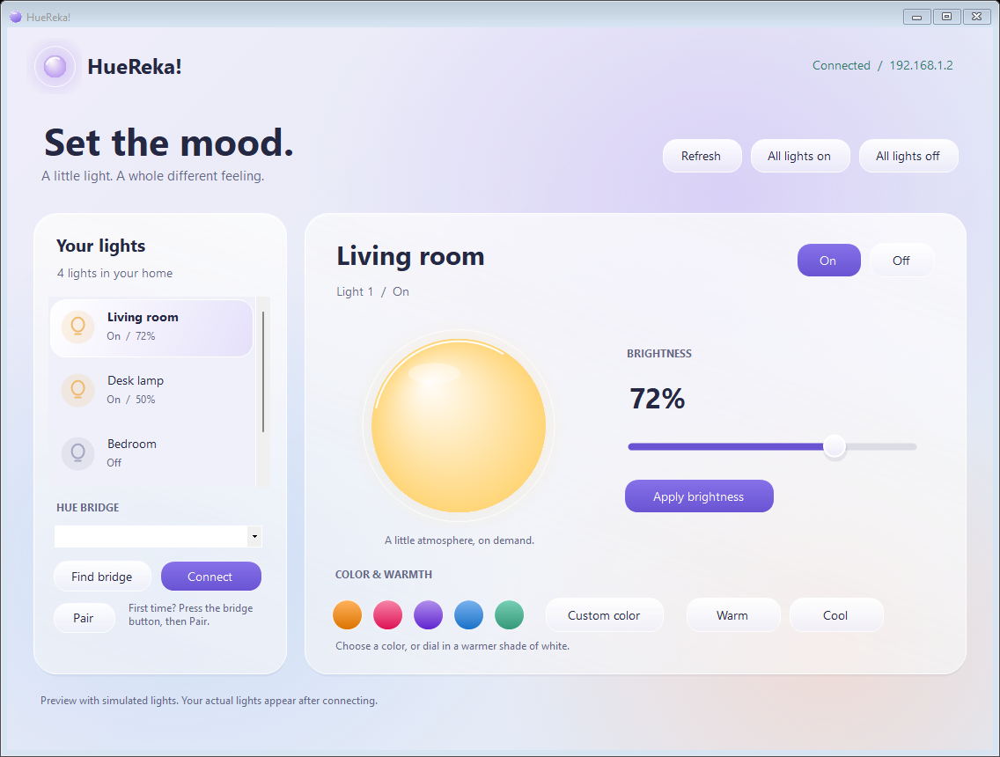

# HueReka!

A small native Windows application for controlling Philips Hue lights on your local network.



The desktop UI uses a Liquid Glass-inspired design with softly tinted glass panels, rounded controls, color swatches, and a light-color preview. This is a native Windows rendering of the visual style; it does not use Apple's platform components.

## Run

Double-click **Launch.cmd**, or run **dist\HueReka!.exe** after building. Windows 10/11 with .NET Framework 4.7.2 or newer is recommended. No SDK, npm packages, Hue account, or cloud login is needed. The executable is unsigned.

1. Connect your PC and Hue Bridge to the same network.
2. Start HueReka. On first launch it searches for your bridge automatically. If exactly one is found, pairing starts right away; otherwise choose a bridge from the dropdown, or type its IPv4 address from the Hue app's bridge settings, and press **Connect** (or Enter).
3. A large pairing card covers the app and asks you to press the round link button on the bridge. HueReka waits up to 90 seconds, with a countdown ring, and finishes pairing as soon as the button is pressed; there is no need to click anything again. Press **Cancel** or Esc to stop waiting. If time runs out, choose **Try again** or **Not now**.
4. Select a light and use **On**, **Off**, the brightness slider, the color swatches, **Custom color**, **Warm**, or **Cool**. Brightness is applied when you release the slider. Unsupported controls are disabled. Brightness and color changes also turn the light on. The orb previews the selected light's color; screen colors may differ from the bulb. Click the **star** next to the light's name to make it your favorite; HueReka selects your favorite every time it opens. Click the star again to remove it.
5. On later launches HueReka reconnects automatically. If your router gave the bridge a new IP address, HueReka finds it again and verifies it is the same bridge using its pinned certificate. Light states refresh automatically every 15 seconds and whenever you return to the window. **All lights on/off** affects every light on that bridge. Use **Pair again** if the bridge was reset or replaced.

### Working with several lights

- **Ctrl+click** adds or removes a light; **Shift+click** selects a range; **Ctrl+A** selects all. Every control then applies to all selected lights that support it, and unreachable or unsupported lights are skipped.
- **Double-click** a light to switch it on or off. Press **Space** in the list to switch all selected lights on or off.
- **F5** refreshes. The brightness slider accepts the arrow keys, Page Up/Down, Home and End, and applies the change when you release the key. Hover over controls for tips.

### Ambience

Open the **Ambience** tab above the controls to let your lights drift slowly through a palette of colors and whites.

1. Select the lights on the left (Ctrl+A for all). Lights that can't dim or change color, such as smart plugs, are skipped.
2. Pick a palette: **Sunset**, **Ocean**, **Forest**, **Candlelight**, **Aurora**, **Daylight**, or your own. **New palette...** lets you combine up to 12 colors and warm, neutral or cool whites.
3. Choose **Drift** (each light wanders at its own pace) or **Together** (all lights change at once), set the speed (every 10 seconds up to every 10 minutes) and the brightness, then press **Start ambience**.

The bridge fades each light smoothly over the whole step, so HueReka sends only one command per light per step. White-only bulbs show the closest white, and dimmable bulbs stay on at the chosen brightness. Changing a light yourself takes it out of the ambience, and **All lights off** stops it. The ambience runs while HueReka is open. If the bridge connection drops, it retries each light after about 5 seconds and carries on where it left off; in **Together** mode a light that missed a change rejoins the others on the current one. When the ambience stops, each light finishes its current fade, then stays as it is. Changing the mode, palette, speed or brightness, or editing its palette, while it runs restarts it with the new choice. From the command line, use `huereka ambience` (see `CLI-GUIDE.md`).

## Command Prompt

The console executable is `dist\huereka.exe`. It shares the desktop app's saved pairing and never opens a window. In a normal Command Prompt:

```bat
cd /d "C:\Repos\HueReka!\dist"
huereka list
huereka on 1
huereka brightness 1 50
huereka color 1 FF8800
huereka warm 1
huereka cool 1
huereka off 1
```

Replace `1` with the ID shown by `huereka list`. Each command affects only that light. Brightness is 1-100 percent; brightness and white-temperature commands also turn the light on. Unsupported capabilities and unreachable lights return errors.

`huereka color <id> <RRGGBB>` accepts exactly six uppercase hexadecimal digits without `#`, such as `FF8800` for orange. It converts RGB to hue, saturation, and brightness and turns the light on; `000000` turns it off. Color-capable bulbs are required. Actual bulb colors may differ from screen colors.

If you have not paired yet, run `huereka pair 192.168.1.20` using your bridge's IP address, then press the bridge's round button when prompted; the command waits up to 90 seconds. Run `huereka help` for usage. Pairing is saved for the current Windows user; no API key needs to appear on the command line.

From any directory, use the full quoted path, for example `"C:\Repos\HueReka!\dist\huereka.exe" off 1`. In batch files that enable delayed expansion, run `setlocal DisableDelayedExpansion` before using the path containing `!`.

Exit codes (`echo %ERRORLEVEL%`): 0 means success, 1 means a connection/bridge/credential error, and 2 means invalid arguments, an unknown palette, an invalid option, an unknown light ID, or an unsupported capability. Errors go to stderr. Run `huereka --self-test` for CLI tests with a simulated bridge; it does not contact real lights or change saved credentials.

## Build and verify

```powershell
powershell.exe -NoProfile -ExecutionPolicy Bypass -File .\build.ps1
$test = Start-Process .\dist\HueReka!.exe -ArgumentList '--test' -Wait -PassThru
$test.ExitCode
```

The build uses the C# compiler included with Windows' .NET Framework. Tests cover mock bridge pairing (including waiting for the link button, timeout and cancel) and routes, light parsing, Hue errors, brightness conversion, Windows credential encryption, form construction, multi-light selection, ambience palettes, planning and pacing, the runner against a simulated bridge, and the Ambience tab and palette editor. They write `preview.png`; failures write `test-failure.txt` and exit with code 1. Tests do not send commands to physical lights.

## Connection and security

Bridge calls use HTTPS and the Hue REST v1 API, following [Philips Hue's getting-started guide](https://developers.meethue.com/develop/get-started-2/). Only discovery uses the internet (`discovery.meethue.com`): on first launch before a bridge is paired, when **Find bridge** is pressed, and when a paired bridge stops answering at its saved address. Manual IP entry and normal controls work locally. A bridge supporting HTTPS is required.

Pairing uses trust on first use: the certificate presented by the entered bridge is pinned for that connection and saved after successful pairing. Subsequent connections require the identical certificate. Perform initial pairing on a trusted home network. To accept a replaced bridge or renewed certificate, press its link button and Pair again. Certificate handling is scoped to bridge requests; discovery uses normal public certificate validation. No plaintext HTTP fallback is used.

The address, certificate fingerprint, and API key are encrypted using Windows DPAPI for the current user and saved in `%LOCALAPPDATA%\HueReka!\connection.dat`. One bridge connection is remembered. Deleting this file forgets the local credentials; it does not revoke the key on the bridge.

## Limitations

No rooms, scenes, schedules, entertainment streaming, remote access, or installer. RGB color controls use the bridge's hue/saturation support; color rendering depends on the bulb. Unreachable lights are shown but cannot be controlled individually. Requests time out after about seven seconds. Physical bridge pairing and bulb behavior must be verified on real hardware.
